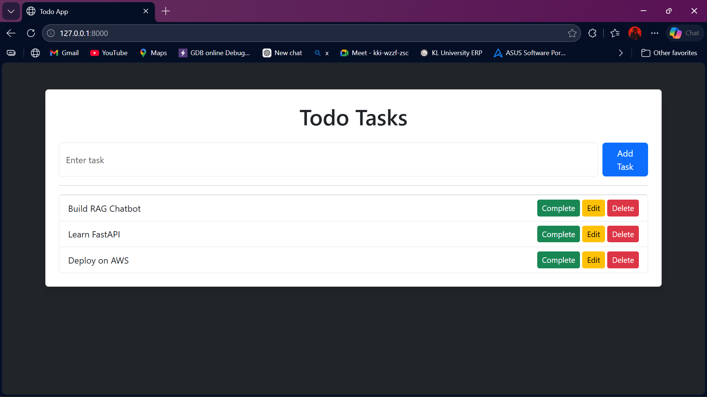

# ✅ Django Todo App with REST API

A full-stack task management app built with Django and Django REST Framework.

## 🚀 Features
- Add, Edit, Delete tasks
- Mark tasks as complete
- Task Priority — 🔴 High / 🟡 Medium / 🟢 Low
- REST API endpoints
- Bootstrap responsive UI

## 🛠️ Tech Stack
- Python · Django · Django REST Framework
- SQLite · Bootstrap · HTML/CSS

## 📡 API Endpoints
GET/POST   /api/tasks/
PUT/DELETE /api/tasks/{id}/

## ⚙️ How to Run Locally
git clone https://github.com/Nirmal649/todo-project
cd todo-project
pip install -r requirements.txt
python manage.py migrate
python manage.py runserver